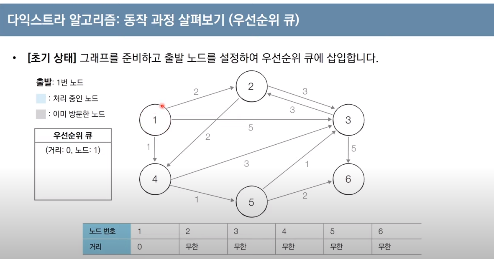
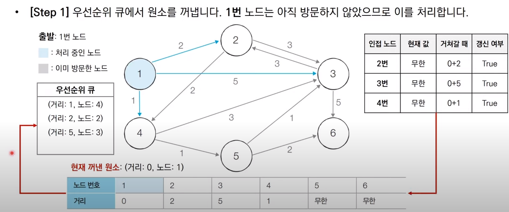

import heapq 
import sys
1. 1번부터 6번까지의 거리를 INF로 미리 준비한다.
   1. 
2. Step1 : 1번에서 출발한다고 하면, 우선순위 큐로 (거리:0, 노드1)로 설정한다. (출발지점에 대한 각각의 노드까지의 거리를 나타내는 리스트가 있어야겠네)
   1. Step1에서, 1번 노드까지의 거리와 연결되어 있는 2,3,4번 노드를 꺼내서 INF로 처리되어있었지만, 현재 노드까지의 최단경로(0)과 거리(d)를 더해 INF와 비교해 갱신을 해준다.
   2. 단, 2,3,4번 노드가 갱신될때만, 우선순위 큐에 갱신된 노드에 대한 정보를 넣어준다.
   3. 0,INF,INF,....들을 갱신시켜주고 우선순위 큐에 넣어준다. 
3. 1번 노드는 '아직 방문하지 않았으므로(visited)' 이를 처리합니다. 즉, 큐에서 꺼내면 방문처리를 해준다!

```python
import heapq
import sys
input = sys.stdin.readline 
INF = int(1e9)
# n 은 노드의 개수, m은 간선의 개수
n, m = map(int, input().split())
start = int(input())
# 각 노드에 연결되어 있는 노드에 대한 정보를 담는 리스트를 만들기
graph = [[] for i in range(n+1)]
# 최단거리 테이블을 모두 무한으로 초기화
distance = [INF] * (n+1)

for _ in range(m):
    a, b, c , map(int,input().split())
    # a번 노드에서 b번 노드로 가는 비용이 c라는 의미 
    graph[a].append(b,c)

def dijkstra(start):
    q = []
    # 시작노드로 가기 위한 최단 경로는 0으로 설정하여, 큐에 삽입
    heapq.heappush(q, (0,start))
    distance[start] = 0 
    while q: #큐가 비어있지 않다면 
        # 가장 최단 거리가 짧은 노드에 대한 정보 꺼내기
        dist, now = heapq.heappop(q)
        # 현재 노드 now가 이미 처리된 적 있는 노드라면 (distance[now] < dist 자체가 이미 처리가 되었기 때문에 distance[now]가 dist보다 작은 것임) 무시 
        if distance[now] < dist:
            continue 
        # 현재 노드와 연결된 다른 인접한 노드들을 확인 
        for i in graph[now]:
            cost = dist + i[1]
            # 현재 노드를 거쳐서, 다른 노드로 이동하는 거리가 더 짧은 경우
            if cost < distance[i[0]]:
                distance[i[0]] = cost # distance 업데이트
                heapq.heappush(q, (cost, i[0]))

dijkstra(start)

for i in range(1, n+1):
    if distance[i] == INF:
        print("도착할 수 없음")
    else:
        print(distance[i])

```
